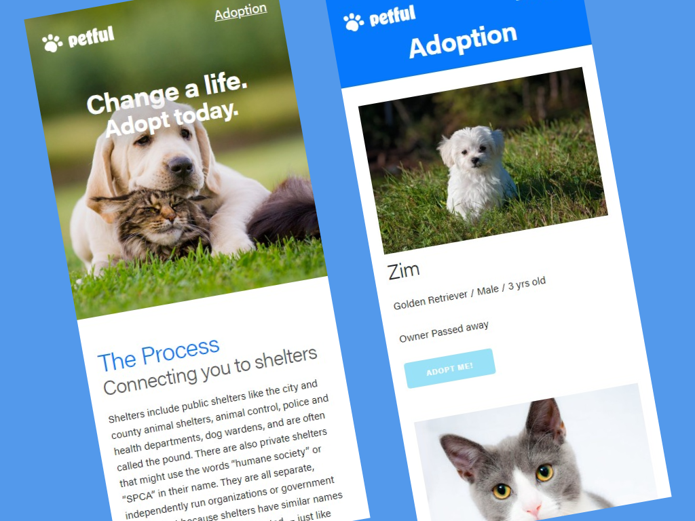

# Petful

Petful is an online pet adoption service that connects people to different shelters with pets up for adoption. We use a first-in-first-out system, so pets that have been there longest get adopted first.

Live app: https://petful-gamma.now.sh/ 
Developed by [Ian Drews](https://github.com/MediocreIan) and [Malcolm Kiano](https://github.com/malcolmkiano)

## How It Works

Each shelter's adoption process is different. Here's an example of how a shelter adoption might work:

1. You find a pet you want to adopt on [Petful](https://petful-gamma.now.sh/).
2. You get in line for adoption and click **Adopt** when it's your turn. This gets sent to the shelter so they can get ready for you.
3. One of the shelter volunteers calls you to arrange a time for you to go see the pet.
4. You go to the shelter and see the pet. They're adorable! You fall in love.
5. You give them your photo ID, pay the adoption fee (usually $25 to $125), get copies of the pet's vaccination records so you can get them licensedd.
6. You take your new pet home!

## Tech Used:

Made with HTML, Sass and React.
